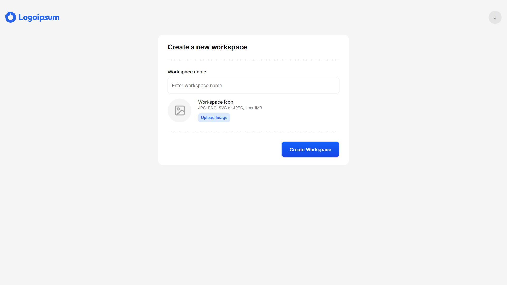
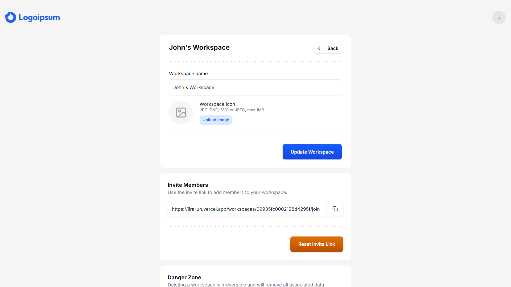
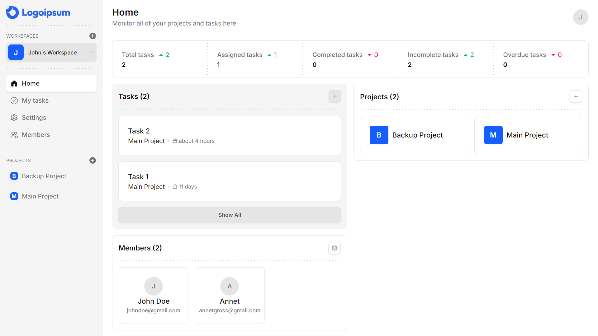
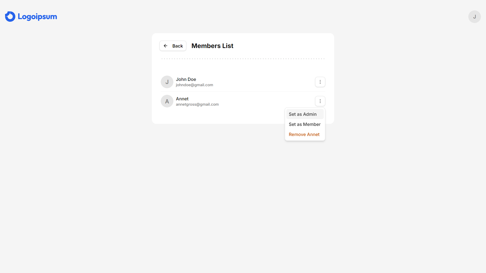
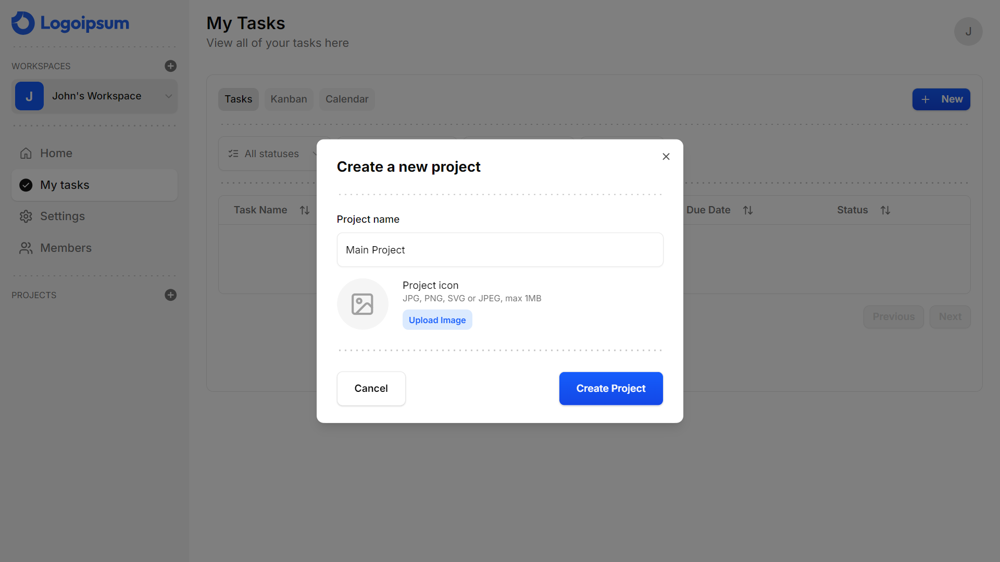
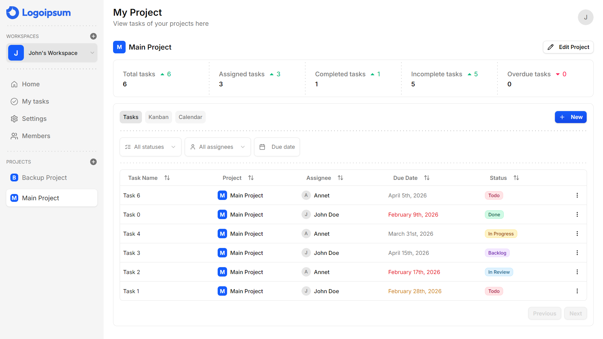
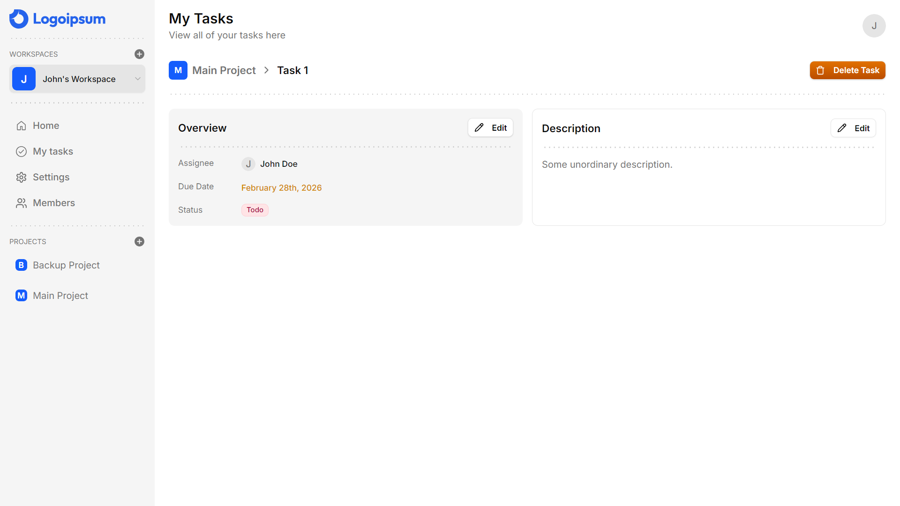
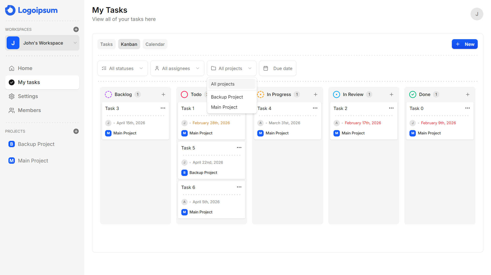
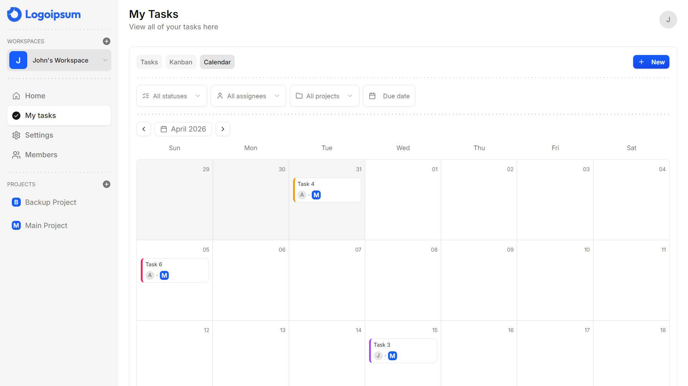
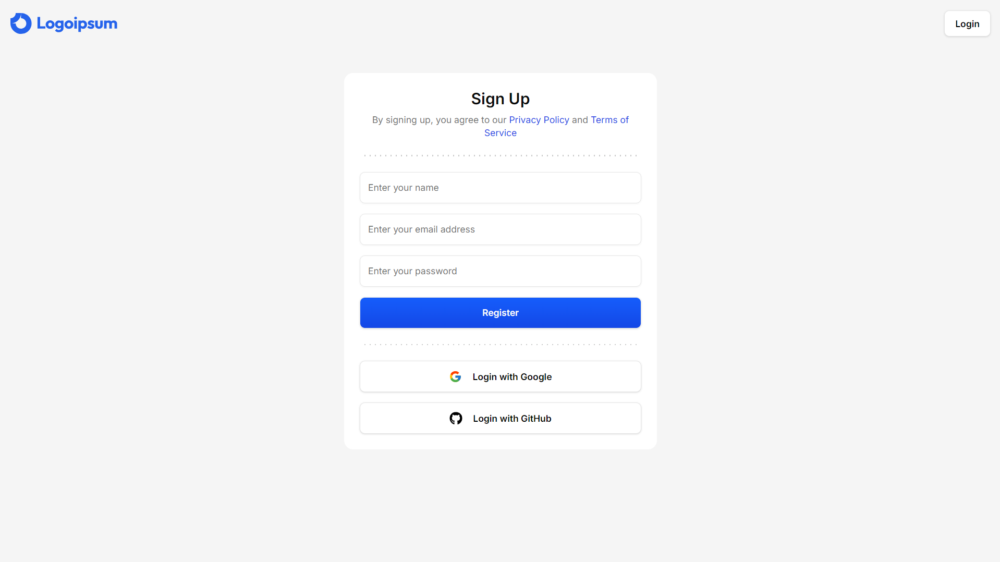

# Project Management App

A modern project management application built with Next.js, featuring workspaces, projects, tasks, and team collaboration.

## Getting Started
```bash
yarn
yarn dev
```

Open [http://localhost:3000](http://localhost:3000)

## Features

### Workspace Creation


### Workspace Settings


### Homepage Dashboard


### Team Members


### Project Management



### Task Management



#### Multiple Views



### Authentication

